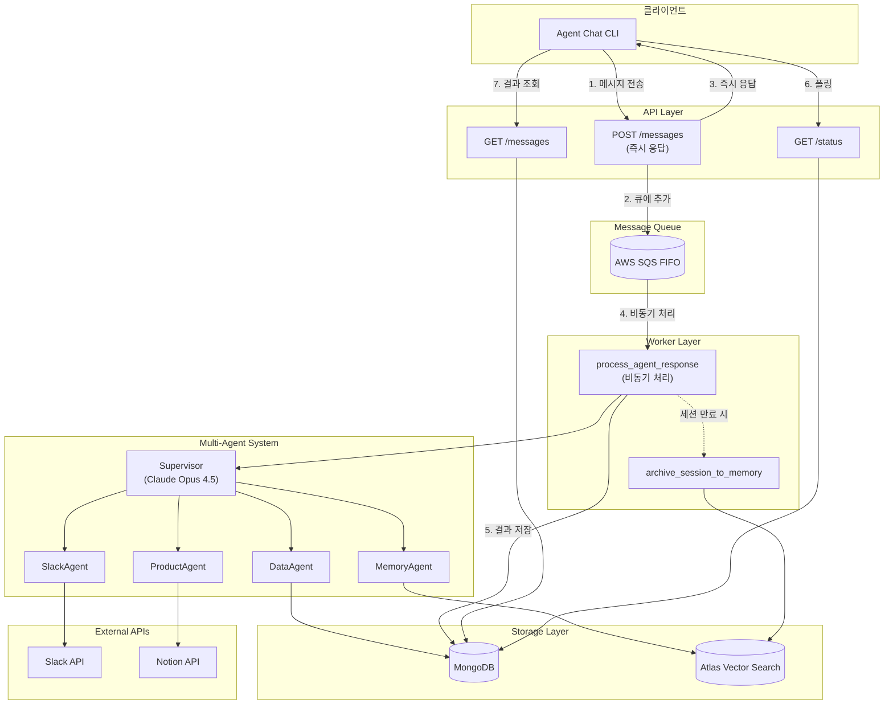
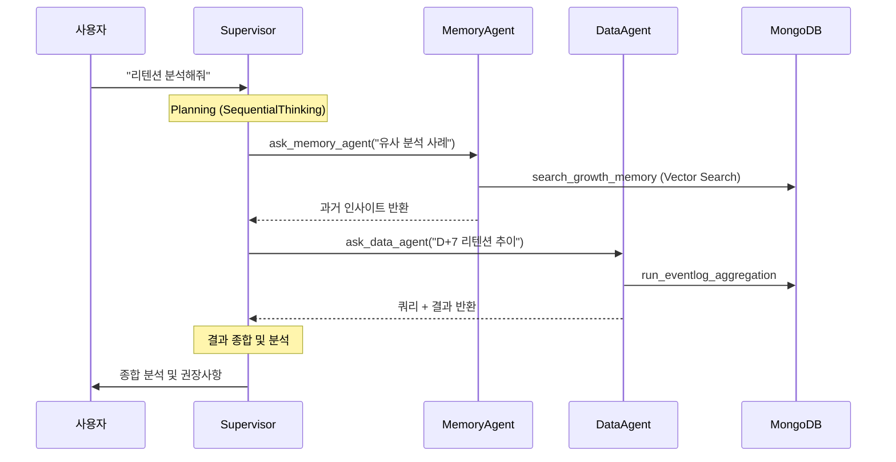

# Agent Vision

**Growth Hacking AI Agent Backend**

> LLM 기반 멀티 에이전트 시스템으로 데이터 분석, 팀 커뮤니케이션, 프로덕트 지식을 통합하여 Growth 인사이트를 도출하는 백엔드 시스템


---

## 프로젝트 동기

### 문제 정의

Growth 분석은 세 가지 정보원을 통합해야 완전한 인사이트를 얻을 수 있습니다:

| 정보 유형 | 설명 | 기존 문제점 |
|-----------|------|-------------|
| **정량적 데이터** | 리텐션, 퍼널, 코호트 분석 | SQL 직접 작성 필요, 시간 소요 |
| **정성적 맥락** | Slack에서의 팀 논의, 의사결정 배경 | 검색 + 수작업 요약 필요 |
| **프로덕트 지식** | Notion에 산재한 기획 문서, 실험 기록 | 문서 위치 파악 어려움 |

**추가 문제**: 과거 분석 결과가 문서화되지 않아 **유사한 분석을 반복**하게 됨

### 해결 방안

**Supervisor + Sub-Agents 아키텍처**로 전문 영역별 AI 에이전트가 협업:

```
"리텐션이 떨어지는 원인을 분석해줘"
        │
        ▼
┌─────────────────────────────────────────────────────┐
│              Supervisor Agent                       │
│  (질문 분석 → 적절한 Sub-Agent 선택 → 결과 종합)           │
└─────────────────────────────────────────────────────┘
        │
        ├─→ MemoryAgent: 과거 유사 분석 사례 RAG 검색
        ├─→ DataAgent: EventLog 기반 리텐션 추이 분석
        ├─→ SlackAgent: 팀에서 논의된 관련 대화 수집
        └─→ ProductAgent: 최근 제품 변경사항 확인
        │
        ▼
   종합된 Growth 인사이트 + 권장 액션
```

---

## 핵심 기능

### Multi-Agent Orchestration
Supervisor가 4개 전문 Sub-Agent를 조율하여 복합적인 Growth 질문에 답변합니다.
각 에이전트는 독립적인 도구와 전문성을 보유합니다.

### Session Resume + Long-term Memory
SDK 세션 자동 복원으로 연속 대화를 지원합니다.
아카이브된 세션은 6단위 구조화 요약 후 RAG 기반 장기 메모리로 활용됩니다.

### Async Processing Pipeline
SQS FIFO로 API 즉시 응답을 보장합니다.
무거운 에이전트 처리는 Worker에서 비동기로 수행하여 사용자 경험을 개선합니다.

---

## 시스템 아키텍처

### 전체 시스템 흐름



### Sub-Agent 호출 흐름



### Sub-Agents 역할 분담

| Agent | 역할 | Tools | 핵심 책임 |
|-------|------|-------|-----------|
| **SlackAgent** | 팀 커뮤니케이션 | `list_slack_channels`, `get_slack_messages` | 채널 자율 선택, 스레드 포함 수집 |
| **ProductDomainAgent** | 프로덕트 지식 | `list_notion_pages`, `get_notion_page`, `get_eventlog_specs` | 배경지식 제공, 문서 요약 |
| **DataAnalysisAgent** | 데이터 분석 | `run_eventlog_aggregation`, `get_eventlog_specs` | 다중 쿼리 실행, 정량 분석 |
| **MemoryAgent** | 과거 인사이트 | `search_growth_memory`, `get_session_messages` | RAG 검색, 유사 사례 조언 |

## 기술 스택

| Category | Technology | 선택 이유 |
|----------|------------|-----------|
| **Language** | Python 3.12 | Type Hints, async/await 네이티브 지원, AI/ML 생태계 |
| **Framework** | FastAPI | 비동기 지원, 자동 API 문서화, Pydantic 통합 |
| **Database** | MongoDB (Motor) | 스키마 유연성, 비동기 드라이버, Vector Search 내장 |
| **AI/LLM** | Claude Agent SDK | 멀티턴 대화, MCP 도구 통합, Session Resume |
| **Queue** | AWS SQS FIFO | 순서 보장, 메시지 그룹별 처리, At-least-once 보장 |
| **Embedding** | OpenAI text-embedding-3-small | 1536-dim, 비용 효율, Atlas Vector Search 호환 |
| **Architecture** | DDD + Hexagonal | 도메인 분리, 테스트 용이, 어댑터 교체 가능 |

---

## 데모

### CLI 데모

<!-- TODO: GIF 또는 Asciinema 녹화 추가 -->
[Demo Placeholder]

**CLI 출력 예시:**

```
> 지난 2주간 결제 전환율 하락 원인 분석해줘

● MemoryAgent
    📋 결제 전환율 관련 과거 분석 사례 검색
    ↳ search_growth_memory
      ✓ 2 similar cases found (similarity: 0.89, 0.82)
    💬 과거 A/B 테스트에서 CTA 위치 변경 시 -12% 영향 확인됨

● DataAgent
    📋 결제 전환 퍼널 분석
    ↳ get_eventlog_specs
      ✓ 139 events loaded
    ↳ run_eventlog_aggregation
      ✓ 결제 페이지 이탈률 +23% 확인
    💬 cart_view → checkout → payment 퍼널에서 checkout 단계 이탈 급증

● SlackAgent
    📋 결제 관련 팀 논의 검색
    ↳ list_slack_channels
      ✓ 3 channels available
    ↳ get_slack_messages (channel: #growth-data)
      ✓ 15 messages retrieved
    💬 12/20 UI 변경 배포 후 CS 문의 증가 언급됨

────────────────────────────────────────

## 분석 결과

### 핵심 발견
1. 12/20 결제 페이지 UI 변경 이후 이탈률 +23% 급증
2. 과거 유사 사례에서 CTA 위치 변경이 전환율에 민감하게 작용

### 권장 사항
1. **즉시**: 이전 UI로 롤백하여 영향 확인
2. **단기**: A/B 테스트로 새 UI 점진적 검증
3. **예상 효과**: 전환율 +15~20% 회복 예상
```

### API 사용 예시

```bash
# 1. 세션 생성
curl -X POST http://localhost:8000/api/v1/agent/sessions
# → {"session_id": "abc123", "status": "active"}

# 2. 메시지 전송 (즉시 응답, 비동기 처리)
curl -X POST http://localhost:8000/api/v1/agent/sessions/abc123/messages \
  -H "Content-Type: application/json" \
  -d '{"content": "리텐션 분석해줘"}'
# → {"status": "processing", "user_message_id": "msg123"}

# 3. 상태 폴링 (처리 완료 대기)
curl http://localhost:8000/api/v1/agent/sessions/abc123/status
# → {"status": "processing"} ... {"status": "active"}

# 4. 결과 조회
curl http://localhost:8000/api/v1/agent/sessions/abc123/messages
# → [user_message, assistant_message, subagent_events...]
```

---

## 설치 및 실행

### Prerequisites

- Python 3.12+
- Docker & Docker Compose
- Node.js 18+ (MCP 서버용)
- MongoDB Atlas 계정 (Vector Search Index 필요)
- AWS 계정 (SQS FIFO Queue)

### Quick Start (Docker)

```bash
# 1. Clone
git clone https://github.com/your-username/agent-vision.git
cd agent-vision

# 2. Configure
cp .env.example .env
# .env 파일에 API 키 설정 (ANTHROPIC, OPENAI, AWS, SLACK, NOTION)

cp src/allowlist.example.json src/allowlist.json
# Slack 채널, Notion 페이지 접근 허용 목록 설정

# 3. Run
docker-compose up --build
# API: http://localhost:8000
# Worker: 자동 시작

# 4. Test
python scripts/agent_chat.py
```

### Local Development

```bash
# 1. 가상환경 설정
python -m venv venv
source venv/bin/activate
pip install -r src/requirements.txt

# 2. MCP 서버 설치 (Sequential Thinking)
npm install -g @modelcontextprotocol/server-sequential-thinking

# 3. 실행 (별도 터미널)
./void run api      # FastAPI with --reload
./void run worker   # SQS Consumer
```

---

## Session Status Flow

```
┌─────────┐     POST /messages     ┌────────────┐     Worker 완료      ┌─────────┐
│ active  │ ──────────────────────▶│ processing │ ──────────────────▶ │ active  │
└─────────┘                        └────────────┘                     └─────────┘
     │
     │ SDK Session Expired
     ▼
┌──────────┐     Memory 추출 (SQS)      ┌──────────────┐
│ archived │ ─────────────────────────▶│ GrowthMemory │
└──────────┘                           └──────────────┘
```

| Status | Description |
|--------|-------------|
| `active` | 대화 진행 가능 |
| `processing` | Worker에서 응답 생성 중 (입력 불가) |
| `archived` | SDK 세션 만료, 장기 메모리로 추출됨 |

---

## 프로젝트 구조

```
src/
├── config.py                 # Pydantic BaseSettings (Allowlist 포함)
├── logging_config.py         # Python 표준 logging 설정
│
├── domain/                   # 순수 Python (외부 의존성 없음)
│   ├── entities/             # AgentSession, Message, GrowthMemory
│   ├── ports/                # Repository 인터페이스 (ABC)
│   ├── value_objects/        # Enums, VO (SessionStatus, MessageRole)
│   └── exceptions.py         # 도메인 예외
│
├── service_layer/            # Use Case 구현
│   └── application/
│       ├── session_management_service.py
│       ├── agent_orchestration_service.py
│       └── growth_memory_service.py
│
├── adapters/                 # 외부 시스템 연동
│   ├── agent/                # Claude Agent SDK
│   │   ├── supervisor/       # Supervisor Agent + MCP Tools
│   │   └── subagents/        # 4개 전문 Sub-Agent
│   │       ├── base.py       # BaseSubAgent 추상 클래스
│   │       ├── slack.py
│   │       ├── product_domain.py
│   │       ├── data_analysis.py
│   │       ├── memory.py
│   │       └── tools/        # Custom MCP Tools
│   ├── mongodb/              # MongoDB 어댑터
│   ├── repositories/         # Repository 구현체
│   ├── aws/                  # SQS Producer/Consumer
│   ├── anthropic/            # Summarization Client
│   ├── openai/               # Embedding Client
│   └── external/             # Slack, Notion 클라이언트
│
└── entrypoints/
    ├── api/                  # FastAPI (routes, schemas, middleware)
    └── worker/               # SQS Worker (tasks, dependencies)
```


## 회고 및 학습 (예시)

### 잘된 점

1. **DDD + Hexagonal Architecture 적용**
   - 도메인 로직과 인프라 분리로 테스트 용이성 확보
   - 어댑터 교체가 용이하여 기술 스택 변경에 유연

2. **Sub-Agent 패턴 설계**
   - 관심사 분리로 각 에이전트 독립적 개발/디버깅 가능
   - 프롬프트 최적화가 에이전트별로 가능

3. **Event Streaming + Immediate Persistence**
   - 실시간 진행 상황 표시로 UX 개선
   - 장애 시에도 이벤트 유실 없음

### 개선할 점

1. **테스트 커버리지 부족**
   - 현재 E2E 위주, 단위 테스트 보강 필요
   - Repository 계층 Mock 테스트 추가 예정

2. **에러 복구 로직**
   - 부분 실패 시 재시도 로직 정교화 필요
   - Circuit Breaker 패턴 도입 고려

3. **모니터링 체계**
   - 에이전트 성능 메트릭 수집 체계화 필요
   - 비용 추적 (토큰 사용량) 기능 추가 예정

### 배운 점

1. **LLM 통합의 어려움**
   - 타입 불일치, 예상치 못한 응답 형식 등 방어적 코딩 필수
   - 프롬프트 엔지니어링이 시스템 품질에 직접적 영향

2. **비동기 아키텍처의 복잡성**
   - SQS + Worker 패턴의 장점 (확장성, 내결함성)
   - 디버깅과 로깅의 중요성 체감

3. **Multi-Agent 설계의 복잡성**
   - 역할 분담과 정보 흐름 설계가 핵심
   - 에이전트 간 중복 호출 방지 로직 필요


